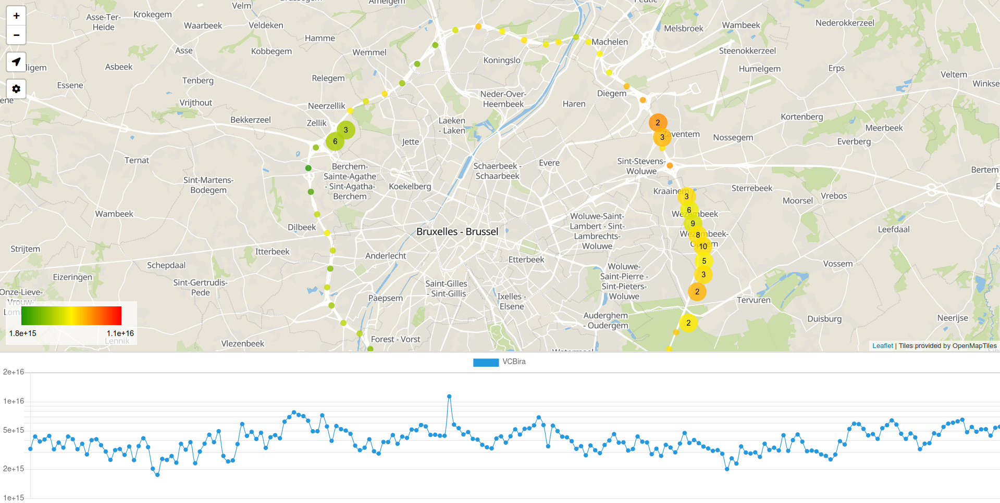

  

# Mobile DOAS Viewer

This application was developed for the [Royal Belgian Institute for Space Aeronomy](https://aeronomie.be) to visualise the measurements of a mobile DOAS instrument in real-time.
However, the application is generic enough to be useful for a real-time visualisation of any sort of geospatial numerical data.
The program should be installed on the computer where the measurements are being written to a cvs-like file. By executing the program, users can connect with any (somewhat up-to-date) browser from any device to the computer and see a visualization of the data as shown below.

  

## Table of Contents
- [Features](#features)
- [Installation](#installation)
  - [Requirements](#requirements)
  - [Setup](#setup)
  - [Adding maps](#maps)
- [Usage](#usage)
- [Acknowledgements](#acknowledgements)
- [License](#license)

## Features
- Display measurements in a timeseries graph
- Display measurements on a map as a colored dot
- The colorscale is calculated based on the minimum and maximum of the measurements that are on-screen
- When zoomed out, measurements cluster together to a larger dot
- Follow mode: automatically pan and zoom map to keep the last *n* measurements in view
- Notifies user of suspiciously long period without new data or loss of connection with the acquisition computer
- Works without an Internet connection

## Installation
### Requirements
The program is designed to work without an Internet connection, so that it can also be used for campaigns in areas with poor to no connectivity. This means that you have to download a map in advance (instructions below). The filesize of such a map can be anywhere between 30MB (small city) to 72GB (entire planet), so make sure your device has sufficient storage! 

### Setup
- Install NodeJS from <https://nodejs.org/en/download/> or with your favorite package manager.
- You can either [download the application directly (zip)](https://github.com/JurriaanD/MobileDOASViewer/archive/master.zip) or clone the repository: `git clone https://github.com/JurriaanD/MobileDOASViewer`.
- Open a terminal and run `npm install` in this directory to install all dependecies (this may take a while).
- Copy `config.example.txt` to `config.txt`.
- Change the config file if needed.

### Adding maps
The viewer uses maps that are stored in [the mbtiles file format](https://docs.mapbox.com/help/glossary/mbtiles/). You can either download a map or generate one yourself based on OpenStreetMap data.

**Downloading premade maps**

OpenMapTiles offers [free downloads of mbtiles](https://openmaptiles.com/downloads/planet/) for personal/open-data usage. Usage of their tiles in production within a company/institution requires a purchase of rights (see their [Terms of use](https://openmaptiles.com/terms/) for more information).

**Generating your own maps**

OpenMapTiles [has open-sourced the code they use to generate their maps](https://github.com/openmaptiles/openmaptiles). The license for maps that you generate yourself with this software is much more permissive, allowing for commercial use (CC-BY 4.0). The drawback is that rendering a map requires some serious computational power. On my laptop with a 12-core CPU, 16GB of RAM and an SSD, it took approximately 3 hours to generate a map of Albania and 4 hours for Belgium. The installation instructions can be found here: <https://github.com/openmaptiles/openmaptiles#build>.

The OpenStreetMap data that is used to generate maps is downloaded from websites like [GeoFabrik](https://www.geofabrik.de/data/download.html). These websites offer OSM data downloads of an entire continent, country, province or city. If you need a map with custom bounds, you [can download a custom OSM extract](https://learnosm.org/en/osm-data/geofabrik-and-hot-export/) and follow the instructions in the `Using your own OSM data` section in `QUICKSTART.md`. Alternatively, you can download an area that is slightly larger than what you need and cut out the area of interest as described below.

The program can be configured with an `openmaptiles.yaml` file. This repo includes such a config file that should get you good maps for most applications. It removes some unnecessary data from the map (POI's, house numbers, ...) and generates tiles up to zoom level 14. 

**Cutting out from world map**

A last option is to download [this map of the entire planet](https://archive.org/details/osm-vector-mbtiles). If this fits on your device, great! If it doens't, you can cut out a part of the map into a new mbtiles file. The OpenMapTiles website has a [great tutorial on how to do this](https://openmaptiles.org/docs/generate/create-custom-extract/). 

## Usage
Run `npm start` or `node src/main.js` to start the server on the acquisition computer.
Open a browser on you device and connect to `*ip address of the acquisition computer*:*port specified in config.txt*`.

## Acknowledgements
- The 'lost connection' notification sound is created by ecfike and downloaded from <https://freesound.org/people/ecfike/sounds/135125/>
- Most of the server-side code is a slightly modified version of <https://github.com/maptiler/tileserver-gl>

